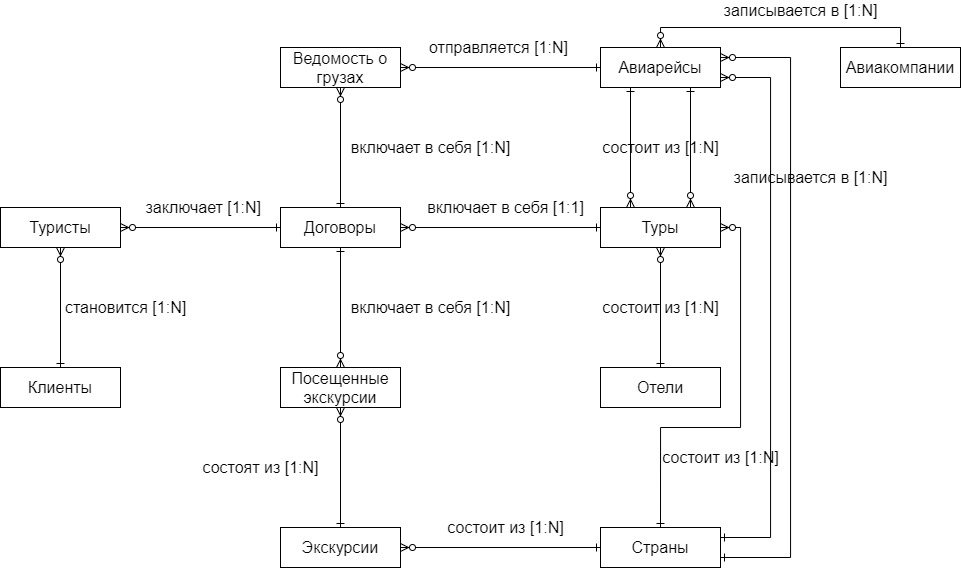
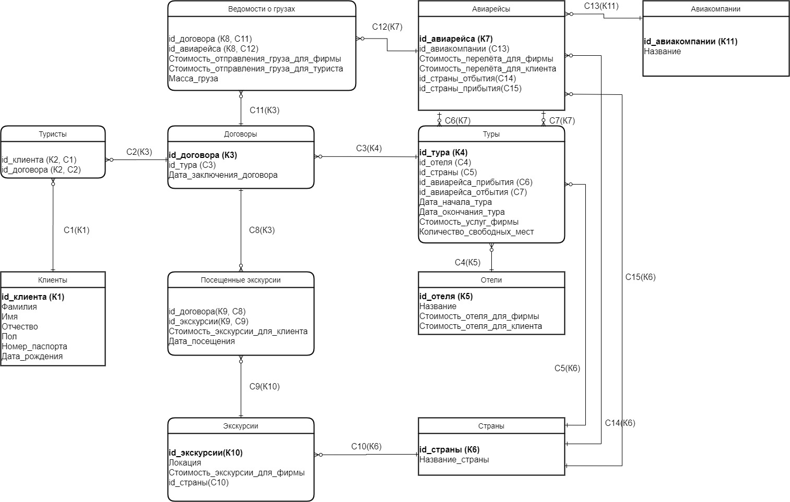

# 1. Информационная система представительства туристической фирмы в зарубежной стране

## 1.1 Тема задачи и предметная область

Вариант 14. Тема: «Информационная система представительства туристической фирмы в зарубежной стране»

## 1.2 Описание предметной области и требования к базе данных

Туристическая фирма "Хорошо там, где нас нет" помогает нашим соотечественникам посмотреть мир и полностью организует их
отдых и досуг. После заключения договора клиент становится туристом. Представительство фирмы занимается получением визы
для каждого клиента, а так же помогают туристам выбрать тур. В брошюре каждого тура указана страна назначения, отель,
дата начала и окончания, номера авиарейсов, на которых турист прилетит в пункт назначения и улетит домой. Так же
представительство фирмы встречает и провожает туристов, всячески помогает им. Туристическая группа делится на 2 типа
туристов: 1 едут отдохнуть, 2 едут за грузом. У некоторых туристов есть дети. Дети не могут самостоятельно получить
визу, отправить груз, заплатить за себя, сами переселиться и никуда ходить без сопровождения
родителей. Ребёнок "привязывается" к одному из родителей. Дети так же вписываются в договор. Таким образом расходы
детей прибавляются к расходам одного из родителей. Представительство организует авиаперелёты, ведёт отчётность о
прибытии и вылете конкретного туриста из страны, расходах каждого из туристов.

Спроектировать базу данных для хранения информации об отдыхающих людях и архива законченных путешествий.

Основная цель разработки базы данных – создать удобный и быстрый способ получения отчетности, расчета прибыли.

Каждый клиент, который едет на отдых, характеризуется следующими параметрами:

1. Фамилия
2. Имя
3. Отчество
4. Номер паспорта
5. Пол
6. Дата рождения

Турист может воспользоваться услугами фирмы и отправить товар к себе на родину.

Или же турист может сходить на экскурсии.

После заселения туристы могут посетить одну из экскурсий. Информация об экскурсии:

1. Локация
2. Описание
3. Стоимость билета

Расходы фирмы в базе хранятся со знаком минус, а расходы туристов со знаком +.

Расходы туристов для фирмы являются доходами.

Туристическая фирма считает свою прибыль исходя из формулы

Прибыль = Расходы + Доходы

# 2. Моделирование базы данных

## 2.1. Сущности и связи

## 2.2. Схема ER-модели

## 2.3. Детализация ER-модели

### 2.3.1. Ключи

К1: Клиенты (id_клиента)

К2: Туристы (id_клиента, id_договора)

К3: Договоры (id_договора)

К4: Туры (id_тура)

К5: Отели (id_отеля)

К6: Страны (id_страны)

К7: Авиарейсы (id_авиарейса)

К8: Ведомости о грузах (id_договора, id_авиарейса)

К9: Посещенные экскурсии (id_договора, id_экскурсии)

К10: Экскурсии (id_экскурсии)

К11: Авиакомпании (id_авиакомпании)

### 2.3.2. Связи

С1 [1-N]: «Клиенты» (id_клиента) → «Туристы» К1 (id_клиента)

С2 [1-N]: «Договоры» (id_договора) → «Туристы» К3 (id_договора)

С3 [1-N]:  «Туры» (id_тура) → «Договоры» К4 (id_тура)

С4 [1-N]: «Отели» (id_отеля)→ «Туры» К5 (id_отеля)

С5 [1-N]: «Страны» (id_страны)→«Туры» К6 (id_страны)

С6 [1-N]: «Авиарейсы» (id_авиарейса) → «Туры» К7 (id_авиарейса)

С7 [1-N]: «Авиарейсы» (id_авиарейса) → «Туры» К7 (id_авиарейса)

С8 [1-N]: «Договоры» (id_договора)→ «Посещенные экскурсии» К3 (id_договора)

С9 [1-N]: «Экскурсии» (id_экскурсии) → «Посещенные экскурсии» К10 (id_экскурсии)

С10 [1-N]: «Страны» (id_страны) → «Экскурсии» К6 (id_экскурсии)

С11 [1-N]: «Договоры» (id_договора)→ «Ведомости о грузах» К3 (id_договора)

С12 [1-N]: «Авиарейсы» (id_авиарейса)→ «Ведомости о грузах» К7 (id_авиарейса)

С13 [1-N]: «Авиакомпании» (id_авиакомпании)→ «Авиарейсы» К11 (id_авиакомпании)

С14 [1-N]: «Страны» (id_страны)→ «Авиарейсы» К6 (id_страны)

С15 [1-N]: «Страны» (id_страны)→ «Авиарейсы» К6 (id_страны)

### 2.3.3. Свойства сущностей

**Клиенты**

| Атрибут        | Тип               | Ключ | Описание               |
|:---------------|:------------------|:-----|:-----------------------|
| id_клиента     | Числовой, счетчик | К1   | Идентификатор клиента  |
| Фамилия        | Текст (25)        |      | Фамилия клиента        |
| Имя            | Текст (25)        |      | Имя клиента            |
| Отчество       | Текст (25)        |      | Отчество клиента       |
| Пол            | Текст (3)         |      | Пол клиента            |
| Номер паспорта | Текст (6)         |      | Номер паспорта клиента |
| Дата рождения  | Дата              |      | Дата рождения клиента  |

**Туристы**

| Атрибут     | Тип               | Ключ   | Описание               |
|:------------|:------------------|:-------|:-----------------------|
| id_клиента  | Числовой, счетчик | К2, С1 | Идентификатор клиента  |
| id_договора | Числовой, счетчик | К2, С2 | Идентификатор договора |

**Договоры**

| Атрибут         | Тип               | Ключ | Описание                 |
|:----------------|:------------------|:-----|:-------------------------|
| id_договора     | Числовой, счетчик | К3   | Идентификатор договора   |
| id_тура         | Числовой, счетчик | С3   | Идентификатор тура       |
| Дата заключения | Дата              |      | Дата заключения договора |

**Туры**

| Атрибут                   | Тип               | Ключ | Описание                         |
|:--------------------------|:------------------|:-----|:---------------------------------|
| id_тура                   | Числовой, счетчик | К4   | Идентификатор тура               |
| id_отеля                  | Числовой, счетчик | С4   | Идентификатор отеля              |
| 
id_страны

   | Числовой, счетчик | С5   | Идентификатор страны             |
| id_авиарейса_прибытия     | Числовой, счетчик | С6   | Идентификатор авиарейса прибытия |
| id_авиарейса_отбытия      | Числовой, счетчик | С7   | Идентификатор авиарейса отбытия  |
| Дата начала               | Дата              |      | Дата начала тура                 |
| Дата окончания            | Дата              |      | Дата окончания тура              |
| Стоимость услуг           | Числовой          |      | Стоимость услуг фирмы            |
| Количество свободных мест | Числовой          |      | Количество свободных мест в туре |

**Отели**

| Атрибут                     | Тип               | Ключ | Описание                                        |
|:----------------------------|:------------------|:-----|:------------------------------------------------|
| id_отеля                    | Числовой, счетчик | К5   | Идентификатор отеля                             |
| Название                    | Текст (25)        |      | Название отеля                                  |
| Стоимость отеля для фирмы   | Числовой          |      | Стоимость номера в отеле, которую платит фирма  |
| Стоимость отеля для клиента | Числовой          |      | Стоимость номера в отеле, которую платит клиент |

**Страны**

| Атрибут   | Тип               | Ключ | Описание             |
|:----------|:------------------|:-----|:---------------------|
| id_страны | Числовой, счетчик | К6   | Идентификатор страны |
| Название  | Текст (25)        |      | Название страны      |

**Авиарейсы**

| Атрибут                        | Тип               | Ключ | Описание                                  |
|:-------------------------------|:------------------|:-----|:------------------------------------------|
| id_авиарейса                   | Числовой, счетчик | К7   | Идентификатор авиарейса                   |
| id_авиакомпании                | Числовой, счетчик | С13  | Идентификатор авиакомпании                |
| Стоимость перелёта для фирмы   | Числовой          |      | Стоимость перелёта, которую платит фирма  |
| Стоимость перелёта для клиента | Числовой          |      | Стоимость перелёта, которую платит клиент |
| id_страны_прибытия             | Числовой, счетчик | С14  | Идентификатор страны                      |
| id_страны_отбытия              | Числовой, счетчик | С15  | Идентификатор страны                      |

**Авиакомпании**

| Атрибут         | Тип               | Ключ | Описание                      |
|:----------------|:------------------|:-----|:------------------------------|
| id_авиакомпании | Числовой, счетчик | К7   | Идентификатор авиакомпании    |
| Название        | Текст (25)        |      | Название компании перевозчика |

**Ведомости о грузах**

| Атрибут                           | Тип               | Ключ    | Описание                                |
|:----------------------------------|:------------------|:--------|:----------------------------------------|
| id_договора                       | Числовой, счетчик | К8, С11 | Идентификатор договора                  |
| id_авиарейса                      | Числовой, счетчик | К8, С12 | Идентификатор авиарейса                 |
| Стоимость отправления для фирмы   | Числовой          |         | Стоимость отправления груза для фирмы   |
| Стоимость отправления для клиента | Числовой          |         | Стоимость отправления груза для клиента |
| Масса                             | Числовой          |         | Масса груза                             |

**Посещённые экскурсии**

| Атрибут             | Тип               | Ключ   | Описание                                     |
|:--------------------|:------------------|:-------|:---------------------------------------------|
| id_договора         | Числовой, счетчик | К9, С8 | Идентификатор договора                       |
| id_экскурсии        | Числовой, счетчик | К9, С9 | Идентификатор экскурсии                      |
| Стоимость экскурсии | Числовой          |        | Стоимость экскурсии, которую заплатил клиент |
| Дата посещения      | Дата              |        | Дата посещения                               |

**Экскурсии**

| Атрибут                       | Тип               | Ключ | Описание                                                  |
|:------------------------------|:------------------|:-----|:----------------------------------------------------------|
| id_экскурсии                  | Числовой, счетчик | К10  | Идентификатор экскурсии                                   |
| Локация                       | Текст (25)        |      | Локация экскурсии                                         |
| Стоимость экскурсии для фирмы | Числовой          |      | Стоимость экскурсии, которую платит фирма                 |
| id_страны                     | Числовой, счетчик | С10  | Идентификатор страны, в которой будет проходить экскурсия |

# 3. Пример данных

Клиенты

| **Id** | **Фамилия** | **Имя** | **Отчество** | **Пол** | **Номер паспорта** | **Дата рождения** |
|:------:|:-----------:|:-------:|:------------:|:-------:|:------------------:|:-----------------:|
|   1    |    Пупки    |  Иван   | Анатольевич  |   Муж   |       999666       |    1972.06.01     |
|   2    |   Пупкин    |   Ян    |   Иванович   |   Муж   |       568932       |    2002.07.03     |
|   3    |    Клин     | Наталья |   Ивановна   |   Жен   |       125678       |    1980.07.02     |

Туристы

| **Id клиента** | **Id договора** |
|:--------------:|:---------------:|
|       1        |        1        |
|       2        |        1        |
|       3        |        2        |

Договоры

| **Id договора** | **Id тура** | **Дата заключения** |
|:---------------:|:-----------:|:-------------------:|
|        1        |      1      |     2020.05.20      |
|        2        |      2      |     2020.06.12      |

Туры

| **Id тура** | **Id отеля** | **Id страны** | **Id авиарейса прибытия** | **Id авиарейса отбытия** | **Дата начала** | **Дата окончания** | **Стоимость услуг фирмы** | **Количество свободных мест** |
|:-----------:|:------------:|:-------------:|:-------------------------:|:------------------------:|:---------------:|:------------------:|:-------------------------:|:-----------------------------:|
|      1      |      1       |       2       |             1             |            3             |   2020.06.01    |     2020.06.07     |           15000           |               2               |
|      2      |      2       |       3       |             2             |            4             |   2020.06.12    |     2020.06.08     |           20000           |               3               |

Отели

| **Id отеля** |  **Название**   | **Стоимость для фирмы** | **Стоимость для клиента** |
|:------------:|:---------------:|:-----------------------:|:-------------------------:|
|      1       | Голубая лагуна  |         -25000          |           35000           |
|      2       | Тропический рай |         -35000          |           40000           |

Страны

| **Id страны** | **Название** |
|:-------------:|:------------:|
|       1       |    Россия    |
|       2       |   Испания    |
|       3       |    Греция    |

Авиарейсы

| **Id авиарейса** | **Id авиакомпании** | **Стоимость перелёта для фирмы** | **Стоимость перелёта для клиента** | **Id страны отбытия** | **Id страны прибытия** |
|:----------------:|:-------------------:|:--------------------------------:|:----------------------------------:|:---------------------:|:----------------------:|
|        1         |          1          |              -20000              |               30000                |           1           |           2            |
|        2         |          1          |              -25000              |               35000                |           1           |           3            |
|        3         |          2          |              -22000              |               29000                |           2           |           1            |
|        4         |          2          |              -32000              |               35000                |           3           |           1            |

Авиакомпании

| **Id авиакомпании** | **Название**  |
|:-------------------:|:-------------:|
|          1          | Быстрее ветра |
|          2          |   Аэрофлот    |

Ведомости о грузах

| **Id договора** | **Id авиарейса** | **Стоимость отправления для фирмы** | **Стоимость отправления для клиента** | **Масса груза** |
|:---------------:|:----------------:|:-----------------------------------:|:-------------------------------------:|:---------------:|
|        2        |        4         |               -10000                |                 15000                 |       20        |
|        2        |        4         |                -3000                |                 4000                  |        2        |

Экскурсии

| **Id экскурсии** | **Локация** | **Стоимость экскурсии для фирмы** | **Id страны** |
|:----------------:|:-----------:|:---------------------------------:|:-------------:|
|        1         |    Гора     |               -4000               |       2       |
|        2         |   Пещера    |               -3000               |       2       |
|        3         |    Пляж     |               -5000               |       3       |

Посещенные экскурсии

| **Id договора** | **Id экскурсии** | **Стоимость экскурсии для клиента** | **Дата посещения** |
|:---------------:|:----------------:|:-----------------------------------:|:------------------:|
|        1        |        1         |                5000                 |     2020.06.03     |
|        1        |        2         |                4500                 |     2020.06.04     |

# 4. Запуск

1. **[sql/schema.sql](schema.sql)** - инициализировать схему базы данных.
2. **[sql/data.sql](data.sql)** - наполнить данными инициализированную базу данных.
